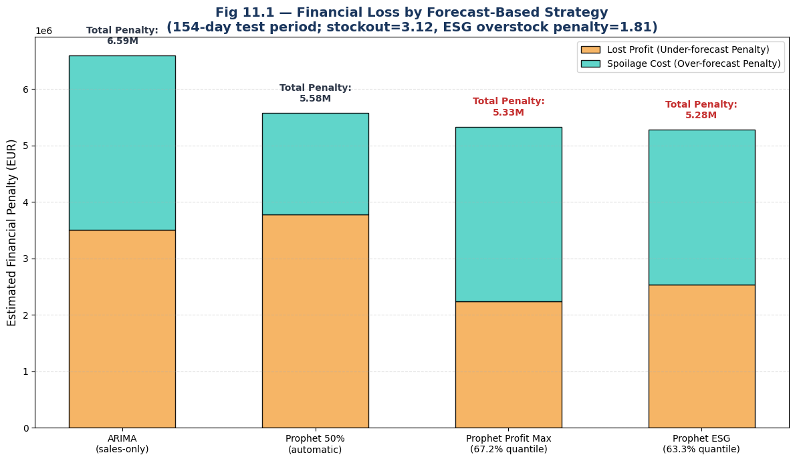
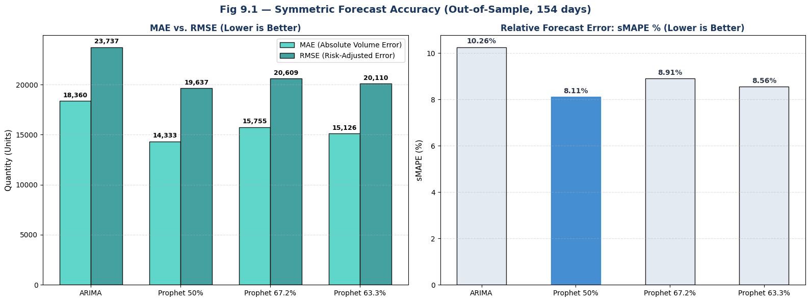
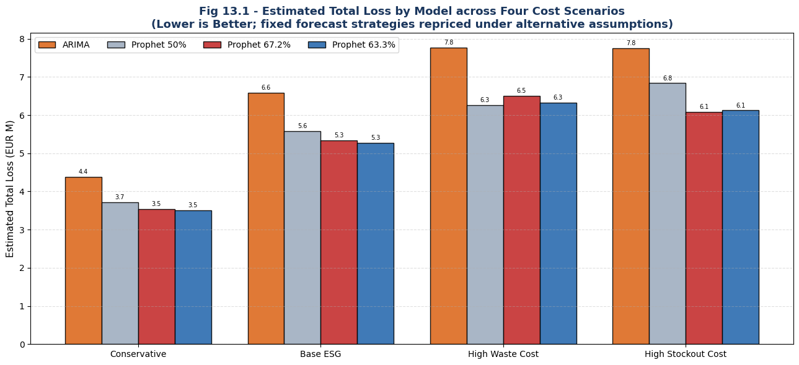

# Demand Forecasting and Cost-Aware Stocking

[](https://colab.research.google.com/github/bodhi584/rohlik-demand-forecasting-cost-aware-stocking/blob/main/notebooks/demand_forecasting_cost_aware_stocking.ipynb)

[Review the notebook](notebooks/demand_forecasting_cost_aware_stocking.ipynb) · [See the results](#results) · [Inspect or rerun](#inspect-or-rerun-the-analysis) · [Read the data notes](data/README.md)

**An evidence-led forecasting and decision-support case study for perishable e-grocery.** It compares ARIMA with feature-aware Prophet forecasts, then translates forecast errors into cost-aware stocking policies using newsvendor quantiles.

> **Result:** Prophet produced significantly lower squared forecast error than the ARIMA benchmark on the 154-day holdout. Under the Base ESG cost scenario, both tuned Prophet policies reduced estimated penalty by about 19-20% versus ARIMA, but their difference was not statistically decisive.



## At a Glance

| | |
|---|---|
| **Decision question** | Which forecast-based stocking policy has the lowest estimated asymmetric penalty under stated costs? |
| **Scope** | 10 high-volume perishable SKUs, Prague_1 warehouse, 154-day chronological holdout |
| **Models** | ARIMA benchmark; Prophet with holiday and discount regressors |
| **Policies** | Prophet 50% central forecast; 67.2% commercial and 63.3% ESG target quantiles |
| **Validation** | MAE, RMSE, sMAPE, Diebold-Mariano test, paired HAC confidence intervals, sensitivity analysis |
| **Primary artifact** | One executed notebook with saved outputs and interpretation |

## Results

### Forecast accuracy

| Strategy | MAE | RMSE | sMAPE |
|---|---:|---:|---:|
| ARIMA benchmark | 18,359.92 | 23,736.95 | 10.26% |
| **Prophet 50%** | **14,332.64** | **19,636.67** | **8.11%** |
| Prophet 67.2% | 15,755.07 | 20,608.69 | 8.91% |
| Prophet 63.3% | 15,126.30 | 20,110.16 | 8.56% |

Prophet 50% is the strongest symmetric forecast. A Diebold-Mariano test on squared error rejects equal predictive accuracy (`DM = 3.8478`, `p < 0.001`) in favor of Prophet over ARIMA.



### Base ESG decision scenario

| Strategy | Target forecast quantile | Estimated penalty | Change vs. ARIMA |
|---|---:|---:|---:|
| ARIMA | n/a | EUR 6.59M | baseline |
| Prophet neutral | 50.0% | EUR 5.58M | -15.3% |
| Prophet commercial | 67.2% | EUR 5.33M | -19.1% |
| Prophet ESG | 63.3% | EUR 5.28M | -19.9% |

The 63.3% policy is numerically lowest in this scenario. The paired HAC 95% confidence interval for the total difference between the 67.2% and 63.3% policies is `EUR -59K to EUR 164K`, so the evidence does not establish a definitive winner between the two tuned policies.

### Sensitivity to cost assumptions

All four fixed Prophet strategies remain below ARIMA across the tested cost scenarios. The numerical winner changes with the cost ratio, as newsvendor theory predicts.

| Scenario | Implied optimal quantile | Numerical minimum | Tuned-policy inference |
|---|---:|---|---|
| Conservative | 63.4% | Prophet 63.3% | No decisive 63.3% vs. 67.2% difference |
| Base ESG | 63.3% | Prophet 63.3% | No decisive 63.3% vs. 67.2% difference |
| High waste cost | 55.5% | Prophet 50% | 63.3% lower than 67.2% |
| High stockout cost | 69.7% | Prophet 67.2% | No decisive 63.3% vs. 67.2% difference |



## What Was Built

- A strict chronological split: training through 31 December 2023 and testing from 1 January to 2 June 2024.
- A sales-only ARIMA benchmark and a Prophet model using holiday and discount regressors.
- Three Prophet decision policies derived from the same forecast distribution.
- A transparent asymmetric loss function for under-forecast and over-forecast quantities.
- Statistical comparisons that separate numerical rankings from supported conclusions.
- A four-scenario stress test that reprices fixed strategies without retraining them.

## Decision Interpretation

The 50%, 63.3%, and 67.2% values are **target forecast quantiles representing stocking policies**. They are not measured service levels, reorder points, or replenishment timing rules.

This project answers a bounded question: under a shared set of cost assumptions, which forecast-based policy produces the lowest estimated penalty? It does not determine when to order or reconstruct actual inventory movements.

## Inspect or Rerun the Analysis

The fastest inspection path is the **Open in Colab** button. The notebook contains complete saved outputs, so the analysis can be reviewed without rerunning the models.

To rerun it with legally obtained inputs:

1. Accept the rules and download the source files from the [Rohlik Sales Forecasting Challenge V2](https://www.kaggle.com/competitions/rohlik-sales-forecasting-challenge-v2).
2. Prepare the three input files described in [the data manifest](data/README.md). Competition-derived CSV files are intentionally not redistributed in this repository; the published project is therefore reviewable but not self-contained.
3. Open the notebook in Colab and upload each file when prompted.

For a local run, use Python 3.10 or 3.11:

```bash
python -m venv .venv
source .venv/bin/activate  # Windows: .venv\Scripts\activate
python -m pip install -r requirements.txt
jupyter notebook notebooks/demand_forecasting_cost_aware_stocking.ipynb
```

Place the prepared files in `data/` before running locally.

## Scope and Limitations

The source data include sales history, availability, price, discount, calendar, and product-category fields. They do not include on-hand inventory, order quantities, replenishment lead times, disposal records, or internal accounting costs.

Therefore:

- the reported financial values are scenario-based penalties, not audited losses or savings;
- observed sales are used as the evaluation target, not true latent demand;
- the analysis compares fixed forecast-based policies, not a complete replenishment system;
- real deployment would require internal inventory, margin, lead-time, replenishment, and waste data.

## Repository Map

```text
.
├── data/                  # Input manifest; restricted source data are not redistributed
├── figures/               # Three headline result visuals
├── notebooks/             # Complete analysis with saved outputs
├── LICENSE                # License for repository code and documentation
├── README.md
└── requirements.txt
```

## Methods and Sources

- Dataset: [Rohlik Sales Forecasting Challenge V2](https://www.kaggle.com/competitions/rohlik-sales-forecasting-challenge-v2)
- Forecasting: [Prophet documentation](https://facebook.github.io/prophet/) and `statsmodels` ARIMA/SARIMAX
- Decision model: newsvendor critical fractile, `Cu / (Cu + Co)`
- Forecast comparison: Diebold-Mariano testing and lag-7 HAC inference

The notebook contains the full method definitions, calculations, and references.

## License

Repository code and documentation are available under the [MIT License](LICENSE). Rohlik/Kaggle data are governed by the competition rules and are not covered by this license.
